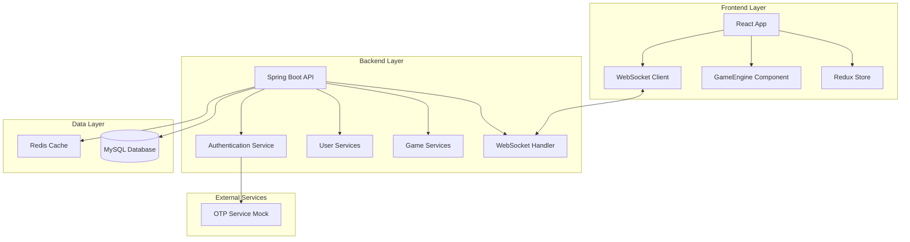

# Design Document: GameVerse Social Gaming Platform

## Overview

GameVerse is a scalable social gaming platform that combines real-time multiplayer gaming with social networking features. The system architecture follows a microservice-inspired approach using Spring Boot for the backend and React with Redux Toolkit for the frontend, connected via WebSocket for real-time communication.

The platform supports 10 different games, social features like profile matching and virtual rooms, and uses a virtual currency system. The design emphasizes real-time synchronization, cheat prevention through server-side game state management, and a cyberpunk/futuristic aesthetic.

## Architecture

### High-Level Architecture



### Technology Stack

**Backend:**
- Java 17+ with Spring Boot 3.x
- Spring Security for authentication
- Spring WebSocket with STOMP protocol
- Hibernate/JPA for database operations
- MySQL 8.0+ for persistent storage
- Redis for session management and real-time data

**Frontend:**
- React 18+ with Vite build tool
- Redux Toolkit for state management
- Tailwind CSS for cyberpunk styling
- SockJS/STOMP client for WebSocket communication
- Canvas API for 2D games (Racing, Bubble Blast)

## Components and Interfaces

### Backend Components

#### Authentication Service
```java
@Service
public class AuthenticationService {
    public OTPResponse sendOTP(String phoneNumber);
    public AuthToken verifyOTP(String phoneNumber, String otp);
    public boolean validateToken(String token);
}
```

#### User Management Service
```java
@Service
public class UserService {
    public User createUser(UserRegistrationRequest request);
    public Profile createProfile(ProfileCreationRequest request);
    public CompatibilityScore calculateCompatibility(Long userId1, Long userId2);
    public List<User> getRecommendedUsers(Long userId);
}
```

#### Game Session Manager
```java
@Service
public class GameSessionManager {
    public GameSession createSession(GameType gameType, List<Long> playerIds);
    public void processGameMove(Long sessionId, GameMove move);
    public GameState getGameState(Long sessionId);
    public void endSession(Long sessionId, GameResult result);
}
```

#### WebSocket Configuration
```java
@Configuration
@EnableWebSocketMessageBroker
public class WebSocketConfig implements WebSocketMessageBrokerConfigurer {
    @Override
    public void configureMessageBroker(MessageBrokerRegistry config) {
        config.enableSimpleBroker("/topic", "/queue");
        config.setApplicationDestinationPrefixes("/app");
    }
}
```

#### Room Management Service
```java
@Service
public class RoomService {
    public Room joinRoom(Long userId, String roomId);
    public void leaveRoom(Long userId, String roomId);
    public void broadcastMessage(String roomId, ChatMessage message);
    public List<User> getActiveUsers(String roomId);
}
```

### Frontend Components

#### GameEngine Component
```typescript
interface GameEngineProps {
  gameType: GameType;
  sessionId: string;
  players: Player[];
  onGameMove: (move: GameMove) => void;
}

export const GameEngine: React.FC<GameEngineProps> = ({
  gameType,
  sessionId,
  players,
  onGameMove
}) => {
  // Dynamically render game based on gameType
  // Handle game-specific logic and rendering
  // Manage local game state and sync with server
};
```

#### WebSocket Hook
```typescript
export const useWebSocket = () => {
  const dispatch = useAppDispatch();
  const client = useRef<Client>();
  
  const connect = useCallback(() => {
    client.current = new Client({
      brokerURL: 'ws://localhost:8080/ws',
      onConnect: () => {
        // Subscribe to user-specific topics
        client.current?.subscribe('/queue/user', handleUserMessage);
        client.current?.subscribe('/topic/rooms', handleRoomMessage);
      }
    });
  }, []);
  
  return { connect, sendMessage, disconnect };
};
```

#### Redux Store Structure
```typescript
interface RootState {
  auth: AuthState;
  user: UserState;
  games: GameState;
  rooms: RoomState;
  social: SocialState;
}

interface GameState {
  currentSession: GameSession | null;
  gameHistory: GameResult[];
  activeGames: Record<string, GameSession>;
}
```

## Data Models

### Database Schema

#### Users Table
```sql
CREATE TABLE users (
    id BIGINT PRIMARY KEY AUTO_INCREMENT,
    phone_number VARCHAR(15) UNIQUE NOT NULL,
    is_verified BOOLEAN DEFAULT FALSE,
    game_coins DECIMAL(10,2) DEFAULT 1000.00,
    created_at TIMESTAMP DEFAULT CURRENT_TIMESTAMP,
    updated_at TIMESTAMP DEFAULT CURRENT_TIMESTAMP ON UPDATE CURRENT_TIMESTAMP,
    INDEX idx_phone (phone_number)
);
```

#### Profiles Table
```sql
CREATE TABLE profiles (
    id BIGINT PRIMARY KEY AUTO_INCREMENT,
    user_id BIGINT NOT NULL,
    avatar_id VARCHAR(50) NOT NULL,
    display_name VARCHAR(50) NOT NULL,
    bio TEXT,
    interest_tags JSON,
    games_played JSON,
    total_games_won INT DEFAULT 0,
    total_games_played INT DEFAULT 0,
    FOREIGN KEY (user_id) REFERENCES users(id) ON DELETE CASCADE,
    INDEX idx_user_id (user_id)
);
```

#### Game Sessions Table
```sql
CREATE TABLE game_sessions (
    id BIGINT PRIMARY KEY AUTO_INCREMENT,
    game_type ENUM('CAR_RACING', 'CHESS', 'UNO', 'RUMMY', 'LUDO', 'TRUTH_DARE', 'MEME_BATTLE', 'BUBBLE_BLAST', 'FIGHTING', 'MATH_MASTER') NOT NULL,
    session_code VARCHAR(10) UNIQUE,
    status ENUM('WAITING', 'IN_PROGRESS', 'COMPLETED', 'CANCELLED') DEFAULT 'WAITING',
    max_players INT NOT NULL,
    current_players INT DEFAULT 0,
    game_state JSON,
    winner_id BIGINT,
    entry_fee DECIMAL(10,2) DEFAULT 0.00,
    prize_pool DECIMAL(10,2) DEFAULT 0.00,
    created_at TIMESTAMP DEFAULT CURRENT_TIMESTAMP,
    started_at TIMESTAMP NULL,
    ended_at TIMESTAMP NULL,
    FOREIGN KEY (winner_id) REFERENCES users(id),
    INDEX idx_game_type (game_type),
    INDEX idx_status (status),
    INDEX idx_session_code (session_code)
);
```

#### Game Participants Table
```sql
CREATE TABLE game_participants (
    id BIGINT PRIMARY KEY AUTO_INCREMENT,
    session_id BIGINT NOT NULL,
    user_id BIGINT NOT NULL,
    player_position INT,
    final_score INT DEFAULT 0,
    coins_won DECIMAL(10,2) DEFAULT 0.00,
    joined_at TIMESTAMP DEFAULT CURRENT_TIMESTAMP,
    FOREIGN KEY (session_id) REFERENCES game_sessions(id) ON DELETE CASCADE,
    FOREIGN KEY (user_id) REFERENCES users(id) ON DELETE CASCADE,
    UNIQUE KEY unique_session_user (session_id, user_id),
    INDEX idx_session_id (session_id),
    INDEX idx_user_id (user_id)
);
```

#### Rooms Table
```sql
CREATE TABLE rooms (
    id VARCHAR(20) PRIMARY KEY,
    name VARCHAR(100) NOT NULL,
    description TEXT,
    max_capacity INT DEFAULT 50,
    current_count INT DEFAULT 0,
    is_active BOOLEAN DEFAULT TRUE,
    created_at TIMESTAMP DEFAULT CURRENT_TIMESTAMP,
    INDEX idx_active (is_active)
);
```

#### Room Participants Table
```sql
CREATE TABLE room_participants (
    id BIGINT PRIMARY KEY AUTO_INCREMENT,
    room_id VARCHAR(20) NOT NULL,
    user_id BIGINT NOT NULL,
    joined_at TIMESTAMP DEFAULT CURRENT_TIMESTAMP,
    is_active BOOLEAN DEFAULT TRUE,
    FOREIGN KEY (room_id) REFERENCES rooms(id) ON DELETE CASCADE,
    FOREIGN KEY (user_id) REFERENCES users(id) ON DELETE CASCADE,
    UNIQUE KEY unique_room_user (room_id, user_id),
    INDEX idx_room_id (room_id),
    INDEX idx_user_id (user_id)
);
```

#### Friendships Table
```sql
CREATE TABLE friendships (
    id BIGINT PRIMARY KEY AUTO_INCREMENT,
    user1_id BIGINT NOT NULL,
    user2_id BIGINT NOT NULL,
    status ENUM('PENDING', 'ACCEPTED', 'BLOCKED') DEFAULT 'PENDING',
    created_at TIMESTAMP DEFAULT CURRENT_TIMESTAMP,
    updated_at TIMESTAMP DEFAULT CURRENT_TIMESTAMP ON UPDATE CURRENT_TIMESTAMP,
    FOREIGN KEY (user1_id) REFERENCES users(id) ON DELETE CASCADE,
    FOREIGN KEY (user2_id) REFERENCES users(id) ON DELETE CASCADE,
    UNIQUE KEY unique_friendship (user1_id, user2_id),
    INDEX idx_user1 (user1_id),
    INDEX idx_user2 (user2_id),
    INDEX idx_status (status)
);
```

#### Meme Posts Table
```sql
CREATE TABLE meme_posts (
    id BIGINT PRIMARY KEY AUTO_INCREMENT,
    user_id BIGINT NOT NULL,
    title VARCHAR(200) NOT NULL,
    image_url VARCHAR(500) NOT NULL,
    description TEXT,
    likes_count INT DEFAULT 0,
    competition_week DATE NOT NULL,
    is_winner BOOLEAN DEFAULT FALSE,
    created_at TIMESTAMP DEFAULT CURRENT_TIMESTAMP,
    FOREIGN KEY (user_id) REFERENCES users(id) ON DELETE CASCADE,
    INDEX idx_user_id (user_id),
    INDEX idx_competition_week (competition_week),
    INDEX idx_likes_count (likes_count DESC)
);
```

#### Game Coin Transactions Table
```sql
CREATE TABLE coin_transactions (
    id BIGINT PRIMARY KEY AUTO_INCREMENT,
    user_id BIGINT NOT NULL,
    transaction_type ENUM('EARNED', 'SPENT', 'BONUS', 'REFUND') NOT NULL,
    amount DECIMAL(10,2) NOT NULL,
    balance_after DECIMAL(10,2) NOT NULL,
    description VARCHAR(200),
    session_id BIGINT NULL,
    created_at TIMESTAMP DEFAULT CURRENT_TIMESTAMP,
    FOREIGN KEY (user_id) REFERENCES users(id) ON DELETE CASCADE,
    FOREIGN KEY (session_id) REFERENCES game_sessions(id),
    INDEX idx_user_id (user_id),
    INDEX idx_transaction_type (transaction_type),
    INDEX idx_created_at (created_at)
);
```

### Game-Specific Data Models

#### Chess Game State
```typescript
interface ChessGameState {
  board: ChessPiece[][];
  currentPlayer: 'white' | 'black';
  moveHistory: ChessMove[];
  gameStatus: 'active' | 'check' | 'checkmate' | 'stalemate' | 'draw';
  timeRemaining: { white: number; black: number };
}
```

#### Racing Game State
```typescript
interface RacingGameState {
  track: TrackData;
  cars: CarPosition[];
  raceStatus: 'waiting' | 'countdown' | 'racing' | 'finished';
  lapCount: number;
  maxLaps: number;
  startTime: number;
}
```

#### Card Game State (Uno/Rummy)
```typescript
interface CardGameState {
  deck: Card[];
  players: PlayerHand[];
  currentPlayer: number;
  discardPile: Card[];
  gamePhase: 'dealing' | 'playing' | 'finished';
  specialRules: Record<string, any>;
}
```

## Correctness Properties

*A property is a characteristic or behavior that should hold true across all valid executions of a system-essentially, a formal statement about what the system should do. Properties serve as the bridge between human-readable specifications and machine-verifiable correctness guarantees.*

Now I need to analyze the acceptance criteria to determine which ones can be tested as properties.

### Converting EARS to Properties

Based on the prework analysis, I'll convert the testable acceptance criteria into universally quantified properties, consolidating related criteria to eliminate redundancy:

**Property 1: Authentication Session Management**
*For any* valid phone number and correct OTP entered within the time limit, the system should create an authenticated session and reject invalid attempts with proper retry limits
**Validates: Requirements 1.2, 1.3, 1.4, 1.5**

**Property 2: Profile Data Persistence**
*For any* user profile creation with avatar and interest selections, the system should store all data correctly and award initial GameCoins
**Validates: Requirements 2.2, 2.3, 2.4, 2.5**

**Property 3: Compatibility Score Calculation**
*For any* pair of users, the compatibility score should be calculated consistently based on shared interests and games, with proper boundary values (10% minimum, 95% maximum)
**Validates: Requirements 3.1, 3.2, 3.3, 3.4, 3.5**

**Property 4: Room Capacity and State Management**
*For any* room, the system should enforce capacity limits (50 users), maintain accurate participant lists, and handle join/leave operations correctly
**Validates: Requirements 6.1, 6.2, 6.4, 6.5**

**Property 5: Real-time Message Broadcasting**
*For any* chat message sent in a room, the system should broadcast it to all current participants in real-time
**Validates: Requirements 6.3**

**Property 6: Profile Discovery and Interaction Tracking**
*For any* user interaction with profiles (like/pass), the system should record the interaction, prevent duplicate displays, and create friendships for mutual likes
**Validates: Requirements 5.1, 5.2, 5.3, 5.4, 5.5**

**Property 7: Private Lobby Code Management**
*For any* private lobby creation, the system should generate unique invite codes, handle capacity limits, and expire unused codes after 24 hours
**Validates: Requirements 7.1, 7.2, 7.3, 7.4, 7.5**

**Property 8: Matchmaking Queue Operations**
*For any* user joining the matchmaking queue, the system should find compatible opponents, handle timeouts appropriately, and allow queue cancellation
**Validates: Requirements 8.1, 8.2, 8.3, 8.4, 8.5**

**Property 9: GameCoin Transaction Management**
*For any* GameCoin transaction (earning, spending, initial award), the system should maintain accurate balances, prevent insufficient balance operations, and log all transactions
**Validates: Requirements 9.1, 9.2, 9.3, 9.4, 9.5**

**Property 10: Real-time Game State Synchronization**
*For any* game move or state change, the system should validate moves server-side, broadcast updates to all participants simultaneously, and handle disconnections with reconnection windows
**Validates: Requirements 10.1, 10.2, 10.3, 10.4, 10.5**

**Property 11: Racing Game Physics and Synchronization**
*For any* car racing game, the system should synchronize player positions in real-time, detect finish line crossings, and apply collision physics consistently
**Validates: Requirements 11.2, 11.3, 11.4, 11.5**

**Property 12: Chess Rule Validation and Timing**
*For any* chess move attempt, the system should validate against standard chess rules, detect endgame conditions, and enforce time limits with forfeit consequences
**Validates: Requirements 12.2, 12.3, 12.4, 12.5**

**Property 13: Card Game Rule Enforcement**
*For any* card game (Uno/Rummy), the system should validate card plays against game rules, handle special cards correctly, and detect win conditions
**Validates: Requirements 13.2, 13.3, 13.4, 13.5, 14.2, 14.3, 14.4, 14.5**

**Property 14: Board Game Movement and Victory**
*For any* Ludo game action, the system should handle dice rolls, piece movements, captures, and victory conditions according to standard rules
**Validates: Requirements 15.2, 15.3, 15.4, 15.5**

**Property 15: Turn-based Game Progression**
*For any* turn-based game (Truth or Dare), the system should manage player rotation, present appropriate content, and advance turns correctly
**Validates: Requirements 16.2, 16.3, 16.4**

**Property 16: Meme Competition Management**
*For any* meme upload and voting cycle, the system should store submissions, handle voting, calculate winners after time periods, and award prizes
**Validates: Requirements 17.1, 17.2, 17.3, 17.4, 17.5**

**Property 17: Timed Game Scoring**
*For any* timed game (Bubble Blast, Math Master), the system should track time limits, award points for correct actions, end games on timeout, and maintain leaderboards
**Validates: Requirements 18.2, 18.3, 18.4, 18.5, 20.2, 20.3, 20.4, 20.5**

**Property 18: Combat System Mechanics**
*For any* fighting game action, the system should apply damage/defense effects, detect health depletion for victory, and calculate combo bonuses
**Validates: Requirements 19.2, 19.3, 19.4**

## Error Handling

### Authentication Errors
- Invalid phone number formats return structured error responses
- OTP expiration and retry limit exceeded scenarios provide clear user feedback
- Session timeout handling with automatic logout and state cleanup

### Game Session Errors
- Network disconnection during games triggers pause/reconnect mechanisms
- Invalid game moves are rejected with explanation of rule violations
- Server-side validation prevents all client-side manipulation attempts

### Resource Management Errors
- Room capacity exceeded returns alternative room suggestions
- Insufficient GameCoins prevents game entry with balance display
- File upload failures for memes provide retry mechanisms with error details

### Real-time Communication Errors
- WebSocket connection failures trigger automatic reconnection with exponential backoff
- Message delivery failures are logged and retried up to 3 times
- Stale game state detection forces client resynchronization

## Testing Strategy

### Dual Testing Approach

The testing strategy employs both unit testing and property-based testing to ensure comprehensive coverage:

**Unit Tests:**
- Verify specific examples and edge cases for each game rule
- Test integration points between frontend and backend components
- Validate error conditions and boundary scenarios
- Focus on concrete examples that demonstrate correct behavior

**Property-Based Tests:**
- Verify universal properties across all possible inputs using randomized test data
- Test game rule enforcement across thousands of generated scenarios
- Validate real-time synchronization under various network conditions
- Ensure data consistency across concurrent user operations

### Property-Based Testing Configuration

**Framework Selection:**
- **Backend (Java):** JUnit 5 with jqwik library for property-based testing
- **Frontend (TypeScript):** Jest with fast-check library for property-based testing

**Test Configuration:**
- Minimum 100 iterations per property test to ensure statistical confidence
- Each property test references its corresponding design document property
- Tag format: **Feature: gameverse-social-gaming-platform, Property {number}: {property_text}**

**Example Property Test Structure:**
```java
@Property
@Label("Feature: gameverse-social-gaming-platform, Property 9: GameCoin Transaction Management")
void gameCoinTransactionsShouldMaintainAccurateBalances(
    @ForAll @Positive BigDecimal initialBalance,
    @ForAll List<@From("transactionGenerator") Transaction> transactions
) {
    // Test that any sequence of valid transactions maintains accurate balance
    // and prevents operations that would result in negative balances
}
```

### Integration Testing
- End-to-end WebSocket communication testing using TestContainers
- Database transaction testing with rollback scenarios
- Multi-user game session testing with simulated concurrent players
- Real-time synchronization testing under network latency conditions

### Performance Testing
- Load testing for 50-user room capacity limits
- Stress testing for concurrent game sessions
- WebSocket connection scaling tests
- Database query performance validation under high user loads